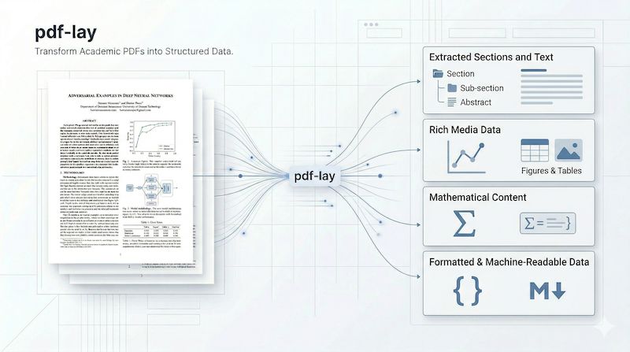

# pdf-lay



`pdf-lay` is a Rust-first PDF layout analysis tool for academic papers.
It extracts section structure, figures, tables, and metadata, then converts
them into representations that are easier to use in LLM and RAG pipelines.

This repository contains:

- `pdf-lay` Rust library crate
- `pdf-lay-cli` crate providing the `pdf-lay` CLI binary
- `pdflay` Python package: bindings to `pdf-lay` built with PyO3

> Status: under active development. The CLI is still experimental, and command
> names or options may change. The current documented commands are `toc` and
> `markdown`.

### Example Output

Using the sample paper [`arxiv.org - 1706.03762v7`](https://arxiv.org/abs/1706.03762),
`pdf-lay` converts a PDF into a structured table of contents and Markdown.

Example TOC output:

```text
[1] Attention Is All You Need  p.1-1  ~102 tokens
[1] Abstract  p.1-1  ~564 tokens
[1] 1 Introduction  p.2-2  ~475 tokens
[1] 2 Background  p.2-3  ~970 tokens
  [2] Attention  p.3-4  ~478 tokens
    [3] Multi-Head Attention  p.4-5  ~815 tokens
[1] 6 Results  p.8-8  ~0 tokens
  [2] Machine Translation  p.8-10  ~1456 tokens  tab:3
[1] 7 Conclusion  p.10-10  ~303 tokens
```

Example Markdown output:

```md
## Abstract

<!-- page 0 -->

The dominant sequence transduction models are based on complex recurrent or
convolutional neural networks that include an encoder and a decoder. The best
performing models also connect the encoder and decoder through an attention
mechanism. We propose a new simple network architecture, the Transformer,
based solely on attention mechanisms, dispensing with recurrence and
convolutions entirely.

## 1 Introduction

<!-- page 1 -->

Recurrent neural networks, long short-term memory and gated recurrent neural
networks in particular, have been firmly established as state of the art
approaches in sequence modeling and transduction problems such as language
modeling and machine translation.
```

## Installation

### Requirements

- Rust 1.75+
- Python 3.9+ for `pdflay`
- `maturin` or `uvx maturin` for the Python binding

### CLI (prebuilt binary)

Download and install the latest release with the install script:

```bash
curl -fsSL https://raw.githubusercontent.com/sonoh5n/pdf-lay/main/scripts/install.sh | sh
```

To install a specific version or to a custom directory:

```bash
curl -fsSL https://raw.githubusercontent.com/sonoh5n/pdf-lay/main/scripts/install.sh \
  | sh -s -- --version v0.1.0-rc.3 --dir /usr/local/bin
```

### CLI (from source)

```bash
cargo install --path crates/pdf-lay-cli
pdf-lay --help
```

Run without installing:

```bash
cargo run -p pdf-lay-cli -- --help
```

### Rust Library

Use the workspace crate from another local Rust project:

```toml
[dependencies]
pdf-lay = { path = "/absolute/path/to/pdf-lay/crates/pdf-lay" }
```

### Python Binding

Install the Python module into a local virtual environment:

```bash
python3 -m venv .venv
source .venv/bin/activate
uvx maturin develop -m crates/pdflay-python/Cargo.toml
```

If you already have `maturin` installed:

```bash
maturin develop -m crates/pdflay-python/Cargo.toml
```

> Note: `pdflay` is not yet published on PyPI (`pip install pdflay` does not work). Use
> `maturin develop` above instead.

### Claude Code Skills

This repository ships four Agent Skills (`pdf`, `pdf-qa`, `pdf-summary`, `pdf-to-llm`) under
`.claude/skills/`. They are model-invoked (no `/slash` command) — Claude Code reads each
skill's `description` and decides when to use it based on your request.

**Path A (plugin, recommended):** register this repository as a Claude Code plugin
marketplace, then install the `pdf-lay` plugin so the skills load in any project:

```
/plugin marketplace add sonoh5n/pdf-lay
/plugin install pdf-lay@pdf-lay-marketplace
```

**Path B (manual, global install):** copy the skills into your global Claude Code
skills directory so they load in any project without a plugin:

```bash
mkdir -p ~/.claude/skills
cp -R .claude/skills/pdf ~/.claude/skills/
cp -R .claude/skills/pdf-qa ~/.claude/skills/
cp -R .claude/skills/pdf-summary ~/.claude/skills/
cp -R .claude/skills/pdf-to-llm ~/.claude/skills/
# From now on, pdf / pdf-qa / pdf-summary / pdf-to-llm are available in any cwd.
```

Either path is only a wrapper around the `pdf-lay` CLI or the `pdflay` Python bindings —
install one of those first (see above), since the skills' `allowed-tools` invoke
`pdf-lay`, `cargo run`, and `python3` directly.

## Usage

### CLI

Show help:

```bash
pdf-lay --help
```

Print the table of contents:

```bash
pdf-lay toc /path/to/paper.pdf
```

Show only sections that contain figures:

```bash
pdf-lay toc /path/to/paper.pdf --figures-only
```

Convert the full PDF to Markdown:

```bash
pdf-lay markdown /path/to/paper.pdf
```

Convert selected sections and write them to a file:

```bash
pdf-lay markdown /path/to/paper.pdf \
  --section METHODS \
  --section RESULTS \
  --image-dir ./images \
  --image-base ./images \
  --output paper.md
```

### Rust

```rust
use pdf_lay::{Config, analyze_pdf};
use std::path::Path;

fn main() -> Result<(), Box<dyn std::error::Error>> {
    let result = analyze_pdf(Path::new("paper.pdf"), &Config::default())?;
    println!("pages: {}", result.document.metadata.pages);
    println!("top-level sections: {}", result.document.toc().len());
    Ok(())
}
```

### Python

```python
import pdflay

doc = pdflay.analyze(
    "paper.pdf",
    image_dir="./images",
    extract_images=True,
    detect_tables=True,
)

print(doc.toc())
print(doc.to_markdown(image_base_path="./images")[:500])
```
